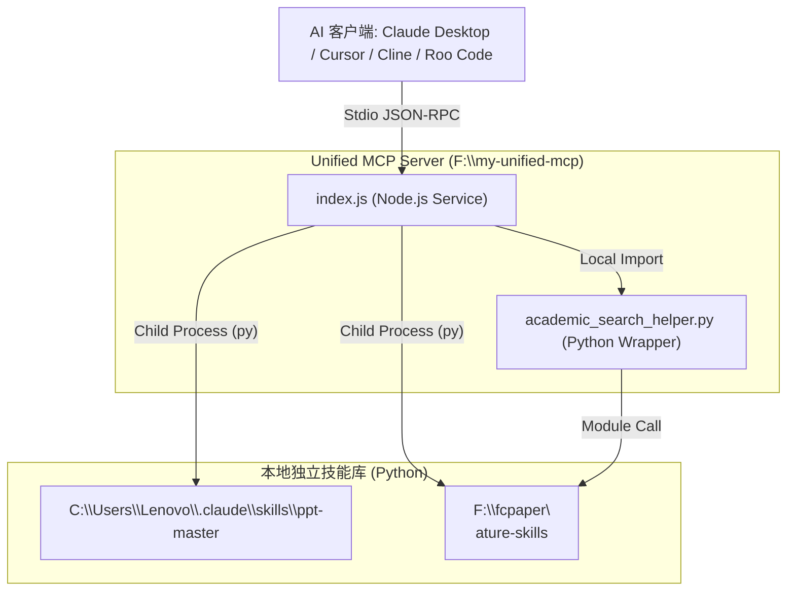

# Unified central MCP (Model Context Protocol) Server

> **资深系统架构师出品 · 本地 AI 代理的中央技能大库**
> 
> 本项目是一个统一的、基于 Node.js 编写的 **Model Context Protocol (MCP)** 服务端。它扮演着“本地智能体技能中枢”的角色，将本地两个极其强大的独立 Skill（**PPT Master** 与 **Nature Skills**）深度集成，封装为标准的、可供各大 AI 客户端直接调用的 MCP Tools。

---

## 1. 项目简介

随着大语言模型（LLM）生态的飞速发展，Model Context Protocol (MCP) 已成为大模型与本地系统、独立脚本进行安全、实时通信的标准协议。

本项目核心设计理念是 **“解耦脚本与应用，统一接口与通信”**。通过本项目：
- **PPT 技能 (`ppt-master`)**：从原路径 `C:\Users\Lenovo\.claude\skills\ppt-master\` 桥接，使得 AI 能够自动化执行源文档转换、大纲切分、SVG 页面设计、精致排版、动效注入、直到最终 PPTX 演示文稿一键导出的全套自动化 Pipeline。
- **Nature 技能 (`nature-skills`)**：从原路径 `F:\fcpaper\nature-skills\` 桥接，提供学术期刊（CNS 级）并发多源检索、精确引用解析、EndNote/RIS 文献库导出，以及动态装载 Nature 级别的学术语气、段落大纲逻辑（Move Models）和经典 phrasebank 替换句式。

这些独立脚本通过底层的 `stdio` 传输信道以标准 JSON 结构化交互，使 AI 拥有了高水准的 PPT 制作和 Nature 级别的科研写作学术辅助能力。

---

## 2. 系统架构与通信流向



---

## 3. 如何添加新 Skill (扩展指南)

本系统采用高扩展性的声明式设计。如果你后续编写了新的 Python 或 Node.js 独立脚本，只需在 `index.js` 中模仿现有结构，完成以下两个核心注册步骤即可。

### 步骤 A：在 `ListToolsRequestSchema` 处理程序中注册 Tool 声明
在 `index.js` 的 `ListToolsRequestSchema` 数组中添加新的 Tool 定义。这里以注册第 3 个工具 `local_data_analyzer` 为例：

```javascript
// 在 ListToolsRequestSchema 中添加：
{
  name: 'local_data_analyzer',
  description: '本地自定义数据科学分析工具。用于解析本地的 CSV/JSON 文件并执行快速统计建模。',
  inputSchema: {
    type: 'object',
    properties: {
      filePath: {
        type: 'string',
        description: '待分析的本地数据文件绝对路径 (例如 F:\\data\\sales.csv)'
      },
      method: {
        type: 'string',
        description: '采用的分析方法：summary (描述性统计，默认), regression (线性回归), trend (趋势分析)。',
        default: 'summary'
      }
    },
    required: ['filePath']
  }
}
```

### 步骤 B：在 `CallToolRequestSchema` 处理程序中绑定执行逻辑
在 `index.js` 的 `CallToolRequestSchema` 执行匹配分支中，添加调用你脚本的 `child_process` 执行代码：

```javascript
// 在 CallToolRequestSchema 匹配块中添加：
if (name === 'local_data_analyzer') {
  const filePath = toolArgs.filePath;
  const method = toolArgs.method || 'summary';
  
  // 假定你的脚本路径位于 F:\my-unified-mcp\scripts\data_analyzer.py
  const scriptPath = 'F:\\my-unified-mcp\\scripts\\data_analyzer.py';
  const pyArgs = ['--file', filePath, '--method', method];
  
  // 调用 index.js 自带的 executePython 辅助方法
  const res = await executePython(scriptPath, pyArgs, 'F:\\my-unified-mcp');
  
  return {
    content: [{
      type: 'text',
      text: res.success ? `分析成功！\n${res.stdout}` : `分析失败！\n${res.stderr}`
    }]
  };
}
```

> [!NOTE]
> **关于动态发现与免重启刷新**：
> MCP 协议原生支持 `notifications/tools/list_changed` 机制。在遵循标准 MCP 协议的高级客户端（如 Cline、Roo Code 或某些集成 Agent）中，当你修改完 `index.js` 保存后，客户端在下一次调用或重新连接时会自动通过 `ListTools` 接口刷新可用 Tool 列表，**无需重新打开客户端进程**。
> 对于不支持自动刷新的客户端（如 Claude Desktop），你只需要在客户端界面的 MCP 配置模块中点击 **"Refresh"** 或 **"Reload"** 即可一键加载新注册的 Tool！

---

## 4. 多 Agent 客户端接入指南

通过标准的 `stdio` 传输模式，本项目能够完美桥接到市面上所有支持 MCP 协议的本地 AI 客户端或 VSCode 插件中。以下是主流客户端的配置详解：

### 4.1 Claude Desktop (官方桌面端)
Claude Desktop 是 Anthropic 官方的客户端。请修改其全局配置文件 `claude_desktop_config.json`：
- **配置文件路径**：`%APPDATA%\Claude\claude_desktop_config.json` (通常为 `C:\Users\<你的用户名>\AppData\Roaming\Claude\claude_desktop_config.json`)
- **配置内容**：

```json
{
  "mcpServers": {
    "unified-central-mcp": {
      "command": "node",
      "args": [
        "F:\\my-unified-mcp\\index.js"
      ],
      "cwd": "F:\\my-unified-mcp"
    }
  }
}
```

*提示：配置完成后，彻底退出 Claude Desktop 并重新启动，你将在聊天框右下角看到一个 🔌 插头图标，点击即可查看已挂载的 `generate_ppt` 和 `nature_analysis` 工具。*

### 4.2 Cursor (AI 编程神器)
Cursor 提供了对 MCP 协议的高级可视化支持。请按照以下步骤添加：
1. 打开 Cursor，进入右上角设置 **"Settings"** (或使用快捷键 `Ctrl + ,`)。
2. 导航至 **"Project Settings"** (或全局 Settings) -> **"Features"** -> **"MCP"** 模块。
3. 点击 **"+ Add New MCP Server"** 按钮。
4. 填写弹窗参数：
   - **Name**: `UnifiedCentralMCP`
   - **Type**: `stdio`
   - **Command**: `node F:\my-unified-mcp\index.js` (或者 Command 填 `node`，在 args 中填写 `F:\my-unified-mcp\index.js`)
5. 点击 **"Save"** 确认保存。
6. 保存后，Cursor 会立即与该 Server 握手，绿色的 **"Active"** 状态灯亮起代表握手成功，右侧会列出当前暴露的所有标准 Tools。

### 4.3 Cline / Roo Code (VSCode AI 插件)
如果你在 VSCode 中使用 `Cline`、`Roo Code` 或 `Devins` 等顶级 AI Agent 编码辅助插件，可以直接在其设置中挂载：
- **配置文件路径**：
  - Cline 配置文件：`%APPDATA%\Code\User\globalStorage\saoudrizwan.claude-dev\settings\cline_mcp_settings.json`
  - Roo Code 配置文件：`%APPDATA%\Code\User\globalStorage\roodevhacks.roo-cline\settings\cline_mcp_settings.json`
- **配置内容**：

```json
{
  "mcpServers": {
    "unified-central-mcp": {
      "command": "node",
      "args": [
        "F:\\my-unified-mcp\\index.js"
      ],
      "cwd": "F:\\my-unified-mcp",
      "disabled": false
    }
  }
}
```

*提示：VSCode 插件会监听此配置文件的更改，当你保存此 JSON 配置后，Cline/Roo Code 插件会自动实时重载并拉起该 Node 服务，瞬间激活两大黑科技技能！*

---

## 5. 项目工程目录清单

```
F:\my-unified-mcp\
├── package.json               # Node.js 项目依赖与 start 脚本定义
├── package-lock.json          # 依赖锁定文件
├── index.js                   # 核心 MCP 服务端 (Tools 注册与 child_process 桥接)
├── academic_search_helper.py  # 学术并发检索 & ID查询 Python 衔接脚本 (核心桥接器)
├── node_modules/              # Node.js 依赖库目录 (已安装 @modelcontextprotocol/sdk 与 js-yaml)
└── README.md                  # 本项目使用与扩展详细说明书
```
